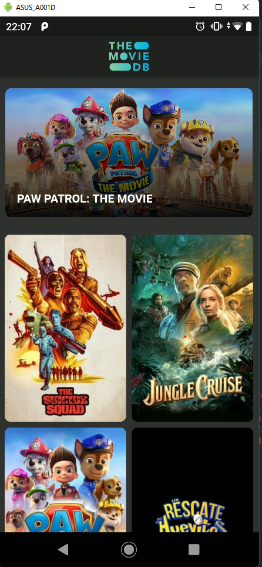
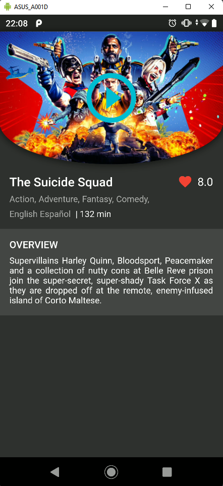
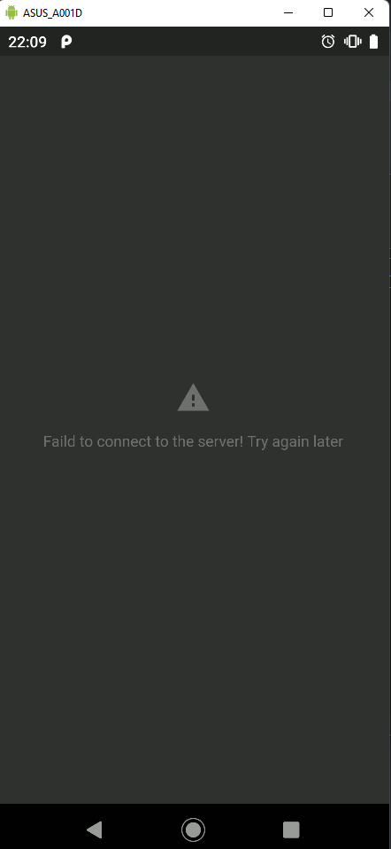

# Cineapp

A new Flutter project.

## Projeto de para ESTUDO

Consumo de API [TMDb](https://github.com/kleberandrade/movies-flutter#:~:text=a%20API%20do-,TMDb,-criado%20para%20disciplina).

Este projeto foi desenvolvido com objetivo de testes e estudos, utilizando o Padrão MVC com arquitetura modular, abordando como objeto de estudos o conceito de Programação Funcional.

## Desenvolvimento

Projeto desenvolvido em **Flutter**, utilizando:

- [dartz](https://pub.dev/packages/dartz)
- [carousel_slider](https://pub.dev/packages/carousel_slider)
- [url_launcher](https://pub.dev/packages/url_launcher)
- [dio](https://pub.dev/packages/dio)

## Demonstração

### Home

### Detalhes

### Error

